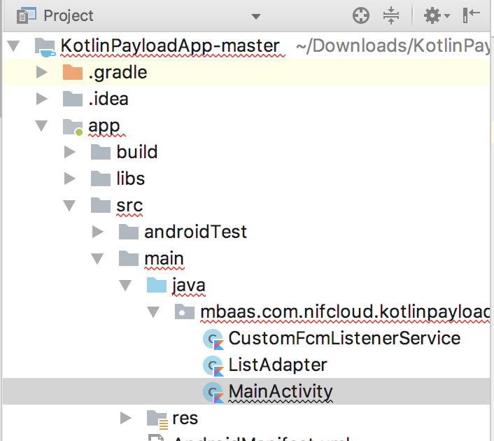
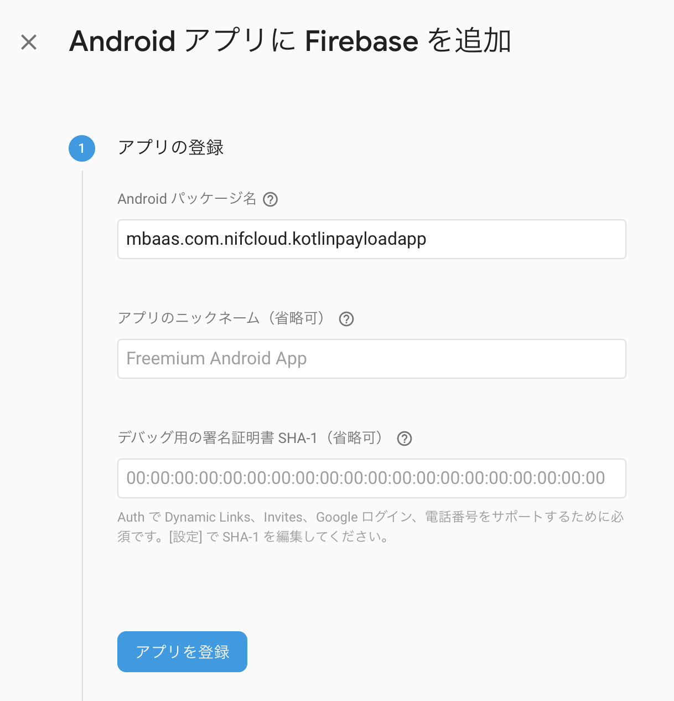

# 【Android】プッシュ通知からデータを取得してみよう！（ペイロード）for Kotlin
*2018/10/29作成*


## 概要
* [ニフクラ mobile backend](https://mbaas.nifcloud.com/)の『プッシュ通知』機能とプッシュ通知を受信する際、プッシュ通知の『ペイロードデータを取得する』機能を実装したサンプルプロジェクトです
* 簡単な操作ですぐに [ニフクラ mobile backend](https://mbaas.nifcloud.com/)の機能を体験いただけます★☆
* このサンプルはAndroid 4以降に対応しています


## ニフクラ mobile backendって何？？
スマートフォンアプリのバックエンド機能（プッシュ通知・データストア・会員管理・ファイルストア・SNS連携・位置情報検索・スクリプト）が**開発不要**、しかも基本**無料**(注1)で使えるクラウドサービス！

詳しくは[こちら](https://mbaas.nifcloud.com/price.htm)をご覧ください


## 動作環境

* Android Studio ver. 3.1
* Android 6.0
* Android SDK v3
    * SDK v2系だと動作しないので注意

※このサンプルアプリは、プッシュ通知を受信する必要があるため実機ビルドが必要です<br>
※上記内容で動作確認をしています

## プッシュ通知の仕組み

* ニフクラ mobile backendのプッシュ通知は、各プラットフォームが提供している通知サービスを利用しています
 * Androidの通知サービス __FCM（Firebase Cloud Messaging）__

 

* 上図のように、アプリ（Android Studio）・サーバー（ニフクラ mobile backend）・通知サービス（FCM）の間でやり取りを行うため、認証が必要になります
 * 認証に必要なプッシュ通知設定ファイルについては、手順にて説明します。

## 手順
### 0.プッシュ通知機能を使うための準備

ニフクラmobile backendとFCMを連携させる場合、Firebaseプロジェクトを作成していただいたあと、下記設定を行なっていただく必要があります。

* APIキーの取得 ※2019年3月以降廃止
* google-services.jsonの取得
* Firebaseプロジェクトの秘密鍵をmobile backendにアップロード

以下のドキュメントを参考に、設定を行ってください。

▼Firebaseプロジェクトの作成とAPIキーの取得▼<br>
https://mbaas.nifcloud.com/doc/current/tutorial/push_setup_android.html<br>
※2019年3月までの間は、Firebaseプロジェクトのサーバーキーもmobile backendにて設定していただく必要があります。

▼google-services.jsonとFirebase秘密鍵の設定方法について▼<br>
https://mbaas.nifcloud.com/doc/current/common/push_setup_fcm_json.html<br>
※[手順5.google-services.jsonの配置](https://github.com/NIFCloud-mbaas/KotlinSegmentPushApp#5-google-servicesjsonの配置)もご参考ください。

### 1. [ニフクラ mobile backend](https://mbaas.nifcloud.com/signup.htm)の準備

* 上記リンクから会員登録（無料）をします
* 登録後、ログインをすると下図のように「アプリの新規作成」画面が出ますので、アプリを作成します


* アプリ作成されると下図のような画面になります
* この２種類のAPIキー（アプリケーションキーとクライアントキー）は先ほどインポートしたAndroidStudioで作成するAndroidアプリにニフクラ mobile backendの紐付けるため、あとで使います


* アプリ設定開いてプッシュ通知の設定をします
   * 「プッシュ通知の許可」で「許可する」選択、「保存する」をクリックします
   * 「Androidプッシュ通知」の「APIキー」には、Firebaseでプロジェクト作成時に発行された「サーバーキー」を記入し、「保存する」をクリックします ※こちらの手順は2019年3月以降廃止予定です
   * 「FCMプッシュ通知」の「FCMプッシュ通知設定ファイルの選択」というボタンをクリックして、 FirebaseからダウンロードしたFirebaseの秘密鍵jsonファイルをアップロードします


## 2. [GitHub](https://github.com/NIFCloud-mbaas/KotlinPayloadApp)からサンプルプロジェクトのダウンロード

* プロジェクトの[Githubページ](https://github.com/NIFCloud-mbaas/KotlinPayloadApp)から「Clone or download」＞「Download ZIP」をクリックします
* プロジェクトを解凍します

### 3. AndroidStudioでアプリを起動

* AndroidStudioを開き、`Open an existing Android Project`を選択し、解凍したプロジェクトを選択します。


* プロジェクトを開きます。`MainActivity.kt`ファイルを開きます。
    * ディレクトリはデフォルトで「Android」が選択されていますので、「Project」に切り替えてから探してください
     
    <center></center>


### 4. APIキーの設定

* `MainActivity.kt`を編集します
* 先程[ニフクラ mobile backend](https://mbaas.nifcloud.com/)のダッシュボード上で確認したAPIキーを貼り付けます


* それぞれ`YOUR_APPLICATION_KEY`と`YOUR_CLIENT_KEY`の部分を書き換えます
 * このとき、ダブルクォーテーション（`"`）を消さないように注意してください！

### 5. google-services.jsonの配置
 
* Firebaseから発行したgoogle-services.jsonをアプリに配置します
   * なお、発行時にAndroidパッケージ名は"mbaas.com.nifcloud.kotlinpayloadapp"としてください

    <center></center> 

   * パッケージ名を別名にした場合はアプリ配置後、google-services.jsonファイル内の"package_name"を"mbaas.com.nifcloud.kotlinpayloadapp"としてください

 

### 6. 動作確認

* AndroidStudioからビルドする。
 * 「プロジェクト場所」\app\build\outputs\apk\ ***.apk ファイルが生成される

* インストールしたアプリを起動します
 * プッシュ通知の許可を求めるアラートが出たら、必ず許可してください！アプリを起動します。


* [ニフクラ mobile backend](https://mbaas.nifcloud.com/)のダッシュボードから「データストア (installationクラス(端末情報))」を確認してみましょう！


### 7.プッシュ通知を送って、データを取得しましょう

* まずはアプリを__起動した状態__でプッシュ通知を送ってみましょう！
* [ニフクラ mobile backend](https://mbaas.nifcloud.com/)のダッシュボードで「プッシュ通知」＞「＋新しいプッシュ通知」をクリックします
* プッシュ通知のフォームが開かれます
* タイトル、メッセージ、JSON、URL（他も後ほど試してみてください）を入力してプッシュ通知を作成します


* 対象端末が存在していることを確認します。
* プッシュ通知を作成しましょう。


* 端末を確認しましょう！
* 少し待つとプッシュ通知が届きます
* 通知が来て、タブすると、ペイロードを受信し、画面に表示します
* ペイロードデータの見方については「解説」をご覧ください


## 解説
* 下記２点について解説します
 * ペイロードデータについて
 * サンプルプロジェクトに実装済みの内容

### ペイロードデータについて
* ニフクラ mobile backendのダッシュボードで入力した内容は以下のようなJSONデータとして、Android端末に届きます

```JSON
{
    "com.nifcloud.mbaas.PushId" : "********",
    "com.nifcloud.mbaas.Data" : "{key : value}",
    "com.nifcloud.mbaas.RichUrl" : "https://mbaas.nifcloud.com/"
}
```

* Androidのプッシュ通知の仕様により、ダッシュボードで「JSON」に入力したデータはそのまま `com.nifcloud.mbaas.Data` に追加されて設定されます
* ダッシュボードで「URL」に設定した場合、　`com.nifcloud.mbaas.RichUrl`として設定されます
* 他にはプッシュ通知のIDは `com.nifcloud.mbaas.PushId` に設定されます

### サンプルプロジェクトに実装済みの内容

#### SDKのインポートと初期設定
* ニフクラ mobile backend の[ドキュメント（クイックスタート）](https://mbaas.nifcloud.com/doc/current/introduction/quickstart_android.html#/Android/)をご用意していますので、ご活用ください

#### ロジック
 * `activity_main.xml`でデザインを作成し、`MainActivity.kt`にロジックを書いています
 * installationクラス(端末情報)が保存される処理は以下のように記述されます
 * アプリを再インストールした時に、端末のデバイストークンが重複した場合の処理を考慮した実装となっています。

```kotlin
//**************** APIキーの設定とSDKの初期化 **********************
 NCMB.initialize(this, "YOUR_APPLICATION_KEY", "YOUR_CLIENT_KEY")
```

* ペイロードを実装するために、カスタムサービスを実装する必要があります。詳細の実装は[こちら](https://mbaas.nifcloud.com/doc/current/push/basic_usage_android.html#%E3%83%97%E3%83%83%E3%82%B7%E3%83%A5%E9%80%9A%E7%9F%A5%E3%81%A7JSON%E3%83%87%E3%83%BC%E3%82%BF%E3%82%92%E5%8F%96%E5%BE%97%E3%81%99%E3%82%8B)に参照ください。

* `AndroidManifest.xml`のサービスを定義している部分を書き換えます。

```xml
<service android:name="mbaas.com.nifcloud.kotlinpayloadapp.CustomFcmListenerService">
    <intent-filter>
        <action android:name="com.google.firebase.MESSAGING_EVENT" />
    </intent-filter>
</service>
```

* `CustomFcmListenerService.kt` を作成します。以下のように実装されます。

```kotlin
class CustomFcmListenerService : NCMBFirebaseMessagingService() {
    private val TAG = "FcmService"
    override fun onMessageReceived(remoteMessage: RemoteMessage) {
        if (remoteMessage.data != null) {
            val data = Bundle()
            val d = remoteMessage.data
            for (key in d.keys) {
                data.putString(key, d[key])
            }

            //ペイロードデータの取得
            if (data.containsKey("com.nifcloud.mbaas.Data")) {
                try {
                    val json = JSONObject(data.getString("com.nifcloud.mbaas.Data"))
                } catch (e: JSONException) {
                    //エラー処理
                }

            } else if (data.containsKey("com.nifcloud.mbaas.PushId")) {
                val pushid = data.getString("com.nifcloud.mbaas.PushId")
                Log.d(TAG, pushid)
            } else if (data.containsKey("com.nifcloud.mbaas.RichUrl")) {
                val url = data.getString("com.nifcloud.mbaas.RichUrl")
                Log.d(TAG, url)
            }
        }
        //デフォルトの通知
        super.onMessageReceived(remoteMessage)
    }
}

```

* 画面にデータを表示するために以下のように`MainActivity.kt`の`onResume`メソッドにて実装します。

```kotlin
public override fun onResume() {
        super.onResume()
        //**************** ペイロード、リッチプッシュを処理する ***************
        val intent = intent

        //プッシュ通知IDを表示
        _pushId = findViewById<TextView>(R.id.txtPushid)
        val pushid = intent.getStringExtra("com.nifcloud.mbaas.PushId")
        _pushId.text = pushid

        //RichURLを表示
        _richurl = findViewById<TextView>(R.id.txtRichurl)
        val richurl = intent.getStringExtra("com.nifcloud.mbaas.RichUrl")
        _richurl.text = richurl

        //プッシュ通知のペイロードを表示
        if (intent.getStringExtra("com.nifcloud.mbaas.Data") != null) {
            try {
                val json = JSONObject(intent.getStringExtra("com.nifcloud.mbaas.Data"))
                if (json != null) {
                    val lv = findViewById<View>(R.id.lsJson) as ListView
                    lv.adapter = ListAdapter(this, json)
                }
            } catch (e: JSONException) {
                //エラー処理
            }

        }
        intent.removeExtra("com.nifcloud.mbaas.RichUrl")
    }
```


## 参考
* ニフクラ mobile backend の[ドキュメント（プッシュ通知（Android））](https://mbaas.nifcloud.com/doc/current/push/basic_usage_android.html)をご用意していますので、ご活用ください
